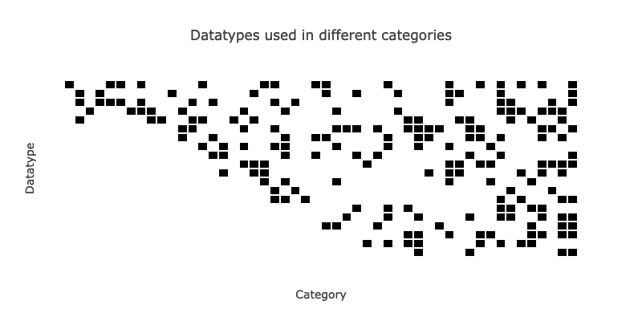
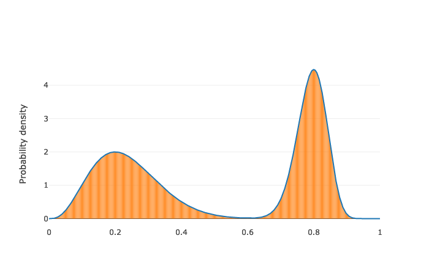
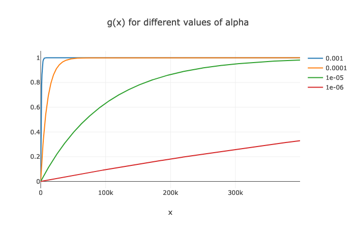

# Using an agent-based model (ABM) for data policy decision-making

The aim of the project was to explore how ABMs are built collaboratively, how they can be used to enhance understanding of complex processes and how they can be used to support policy decisions.
We set out to build an ABM of the data economy.
We initially built a basic ABM in which consumers had to choose between different firms delivering one product, all in the same category (e.g. search engines, e-mail services, ...). The consumer choice was based on the quality of the product offered by each of the firms, the privacy score of the firms and the privacy concern of the individual consumers. We added a data portability component, which would allow users to port their data from one firm to another (and make certain firms more attractive because of the ability to port).

After consultation, we decided to expand the model

* to include multiple product categories, which collect different types of data about consumers; companies have products in one or more categories
* to include birth and death of firms
* to allow for the development of new categories
* to gauge the effect of openness of data sharing on innovation

In what follows, we will describe the parts and mechanisms in the model, and the model design choices we have made. Next, we explain how the model can be run and provide some explanation regarding the organisation of the project.


## Types of agents

There are two types of agents:

1. Consumers
2. Firms


### Consumers

Consumers have the following attributes:

* Wealth: uniformly chosen in [1, 10], fixed for the simulation. At every tick, the consumer will spend this amount fully, dividing it uniformly over the products they consume.
* Needs per category: see below for information on how this is assigned.
* Privacy concern: a number between 0 and 1, that is fixed during the simulation (unless a privacy shock scenario is deployed, see below). This is drawn from a capped normal distribution for which the user can provide mean and variance.


### Firms

* Products and their quality: firms produce maximal one product in each category. Each product has a certain quality which evolves throughout the simulation. See below for details on how firms break into categories they don't have a product in yet, and how quality is assigned.
* Capital: the starting capital can be one of two user-supplied values, depending on whether the firm is big or small. Firms created during the simulation get the small starting capital. Capital is gained when consumers use the firm's products, and spend on innovation.
* Privacy score: a number between 0 and 1, with 0 being bad and 1 being good. This is drawn from a capped normal distribution for which the user can provide mean and variance.
* Big/small firms: at the initialisation of the model, the user can specify how many of the initial firms are big firms. Big firms start off with a higher capital. Additionally, the quality of their product is initialised at 2, rather than 1. We also make sure that the categories in which the big firms are active are high need-categories to avoid the infelicity of being a big firm by having a product little consumers need/use.
* Firm investment profile: the distribution of how often firms will try to innovate by
  - increasing the quality of an existing product
  - trying to launch a product in an existing category
  - trying to launch a product in a non-existing category.

In the current implementation, all firms have the same firm investment profile, however, in a future version of the model this could be varied. See below for more details on innovation.


## Product categories and data types

Products are what bind the two types of agents: consumers buy products in certain categories from firms. We only allow for each firm to have one product per category.

A product category is defined by:

* the data types that are associated with it (e.g. verbal messages, pictures, playlists, search terms, ...)
* the need for products in a category.

During the setup of the simulation, we define a limited number of categories and assign some of these to the initial number of firms in the simulation. They are associated with a limited number of data types.  During the simulation, new firms will crop up, in new or existing categories.

### Data types

We limit the total number of data types for the simulation. This is done for convenience only, as we predefine a matrix which will hold information about which datatypes are associated to each product.

The user defines a number of parameters governing how this matrix is built.

Firstly, for the initial categories in the model, we randomly choose up to three out of `n_data_types_init` datatypes per category. Next, for the categories that are not part of the initial set-up, we increase the number of data types they use, and the number of data types these can be chosen from, according to the parameter `growth_factor`. This ensures that the last categories have more, and more varied, datatypes than the earlier ones. This is relevant, since we assign categories to new firms according to an ordered list; hence, as the simulation moves on, there is a move towards more complicated products in terms of the datatypes involved.



### Need profile

How much does a single consumer "need" a certain category? We decided to model this as the probability that they will use a product from the category in a single tick. This means we need to specify a distribution on the unit interval [0, 1], from which we draw the probability that a consumer will use a category. These distributions are called need profiles.

The overall need profile for any category is defined by a distribution, which is a mixture of beta distributions. Beta distributions are versatile distributions on the unit interval and hence ideal to describe probabilities, which by definition live on the unit interval. Each consumer is assigned their individual need by drawing from this distribution randomly (this is all handled during the setup of the simulation). The distributions are created as follows:

1. Choose the number of beta distributions to be mixed, $N$
2. From a uniform distribution on [0, 1], choose $N$ numbers which are the modes of the beta distributions that will be mixed
3. From a uniform distribution on [0.001, 0.01], choose $N$ variances for the distributions that will be mixed.
4. Add together the beta distributions and renormalise to obtain the final need profile.

The user can redefine the intervals above, but note that the function to calculate the parameters of the beta distribution form the mode and the variance might fail.

To assign individual needs for a category, we discretise the need profile into 500 bins, and draw from this distribution. This information is stored in a need matrix $N$ where
$$
N[i, j] = \textrm{probability that consumer } i \textrm{ will use a product from category } j
$$




## Mechanisms

### Consumers choosing in which categories they will buy products

Each consumer has been assigned a need for each category. This is effectively a probability that a consumer will use a product within that category. Hence, the first step is to decide whether each consumer will consume from each category, given that there are products available in that category. This information is captured in a usage mask $U$:
$$
U[i, j] = 1 \textrm{ if a random number in } [0, 1] < N[i, j], \textrm{ else }  0
$$
for consumer $i$ and category $j$. If there are no products available in category $j$, $U[i, j]$ is also set to zero.

### Consumers choosing which products they would buy in each category

Having decided which categories the consumer will be making a purchase in, we need to decide which firms, in each category, these purchases will be made from (i.e., which products will be chosen within each category). To do so, we calculate the utility of each product for every user (see below). These are exponentiated and normalised per category such that we have a probability distribution over all existing products (or equivalently, firms active in the category) for each (consumer, category) pair. From this distribution, we pick one product (i.e., one firm) that the user will use in each category. This is combined with the usage mask to determine which products each consumer will use in the tick.

The utility of each product $j$ for a given consumer is a weighted sum of its quality, how often the consumer has used this product before, how often the consumer has used the firm making the product before, and the product of the privacy concern of the consumer $i$ with the privacy score of the firm $k$:


\begin{eqnarray*}
\textrm{Utility}(i, j, k) & = &  w_{q} \cdot Q[k, j] \\
\, & + & w_{lc} \cdot P(i, k, j) \\
\, & + & w_{lf} \cdot\sum_k P(i, k, j) \\
\, & - & w_{pr} \cdot K(i) \cdot (1 - L(k))
\end{eqnarray*}


where $Q$ is the quality matrix of dimensions (firm, category), $P$ is a (consumer, firm, category)-size matrix counting previous usage, $K$ is an array which holds the individual privacy concerns of consumers, $L$ is an array holding the privacy scores of individual firms, $w_q$ is the quality weight `w_qual`, $w_{lc}$ is the weight on loyalty to a firm within the category (`w_loyal_category`), $w_{lf}$ is the weight on loyalty to a firm (which includes usage in other categories) `w_loyal_firm` and $w_{pr}$ is the weight on privacy considerations `w_priv`.

The previous usage of a product is devalued exponentially, i.e., usage in the previous tick is counted as 1, usage in the penultimate tick is counted as $\exp(-\alpha)$, usage two ticks ago is counted as $\exp(-2\alpha)$, etc, where $\alpha$ is provided by the user through the parameter `alpha_usage_decay`.

The utilities of available products are exponentiated

$$
\tilde{U}(i, j, k) = \exp(w_l \cdot \textrm{Utility}(i, j, k))
$$

and normalised such that

$$
\sum_k \tilde{U}(i, j, k) = 1 \,\,\,\, \forall i, j,
$$

i.e., they form a probability distribution on the available products. We then choose from the available products based on these probabilities.

Note that if a consumer has asked a firm to delete their data, they will never use products from that firm again. This is ensured by using a privacy mask that is created at the time of the scenario.

For each product that is used by a consumer, the firm receives data of all the datatypes linked to the product category for that tick. We keep track of which product has generated this data. It is possible for a firm to receive from a single consumer multiple data units of the same datatype, as they come from different products with overlapping datatypes.

### Firm birth

At each tick, new firms can enter the simulation. We have specified a maximum of firms that can enter the simulation for practical reasons (we need to be able to define the sizes of the matrices involved in the simulation), but this limit is never hit. At each tick, we draw the number of new firms from a Poisson distribution for which the parameter is user-provided.

When a firm is born, it is given the same amount of capital that small firms get during the simulation set-up. With a certain user-defined probability, it will enter a new, non-existing category (unless we run out of categories, which can be avoided by changing the parameter `n_total_categories`). Firms enter the first category that has not seen products before.

A certain proportion of the newly born firms will enter a category that already exists. Which categories those are, is determined by drawing from a the existing categories with probabilities defined by

$$
P(\textrm{entering category } i) \,\~{}\, \exp(w \cdot \textrm{mean usage of category } i \textrm{ in previous ticks)}
$$

This is clearly a first-order approximation of what happens in the real world, as it doesn't take other factors into effect, such as how many firms have failed in the category before. That type of behaviour could be added in an extension of the model.

Upon entering an existing category, the quality of the firm's product is a random number in $[q_m - 1, q_m]$ where $q_m$ is the maximal quality of the products in the relevant category. The user can choose to change  the size of the interval by subtracting another number from that upper limit by changing the parameter `qual_diff_param`. We further ensure that the quality assigned is not lower than 1.

### Firm death

Firms leave the simulation if

* they have had no customers for the last 5 ticks, or,
* their capital has been below a user-defined threshold `capital_cutoff` for the last 5 ticks

The number of ticks in the definitions above can be changed by redefining the parameters `no_usage_ticks_before_death` and `no_money_ticks_before_death`.

### Innovation
At each tick, a firm innovates in exactly one of the following:

- in an existing product;
- in a new product in an existing category;
- or in a new category altogether.

The probabilities for each of these to happen are encoded in the firm innovation profile (see above), which are used to determine which type of investment will happen in a given tick (this happens on a firm-to-firm basis). It is technically possible that either of the last two options is not available, in which case the probabilities will be rescaled to reflect this.

The investment is calculated based on two factors: capital and data. Each firm invests as much capital as possible, and there is a user-defined maximum to the capital that can be invested. Denote the capital to be invested as $C$.

#### Investing in an existing product
A firm that has multiple products has to choose which one it wishes to invest in. To do so, we calculate a utility for each of their products, which is the weighted sum of how many firms are active in the category and what the overall usage in each category was in the last tick; i.e., firms invests in popular categories with high competition. The user can determine the weights (`w_num_firms_per_cat` and `w_usage`), but they are the same for all firms. The utilities are exponentiated and normalised per firm to sum to one; we then pick a category for each company based on these distributions.

Next, we calculate how much data within each firm is available that is relevant to their chosen category, i.e., how much data of the types that are used in the category is available (even if it originated from a different category). Different firms have different skill at combining data, which increases the raw value of the data if the chosen category requires two or more datatypes:

$$
V([x_0, x_1, \ldots, x_n], d) = \left(\sum_{i=0}^{n} x_i\right)  \left(1 + d \cdot h(x)\right)
$$

where $d$ is the data skill of the firm and $h(x) =  1$ if at least two of $x_0, \ldots, x_n$ are strictly positive, 0 else. The data skill of firms is drawn from a uniform distribution on the unit interval. The user can change the interval by adjusting the parameters `data_skill_range_low` and `data_skill_range_high`.

The investment is finally calculated as $I = V \cdot C$; and normalised to be between 0 and 1 for all firms. This implies that both data and capital have to be available to be able to innovate. The normalisation is calucated as $g(I)$

$$
g(x) = 1 - \exp(-\alpha x).
$$


The parameter $\alpha$ is set by the user as `new_product_scaler_alpha`.



The quality of each product is updated along a square root function as follows. Let

$$
q(x) = x^\alpha.
$$

If a company invests $I$ in a product that has quality $q_1$, the new quality $q_2$ is

$$
q_2 = q\left(\,q^{-1}(q_1) + g(I)\,\right).
$$


#### Investing in a new product in an existing category

The process of choosing which category to invest in and what the quality of the new product will be are very similar to what happens for new firms entering a category that already exists. The only difference is that for an existing firm, we do not only take into account the popularity of the candidate categories, but also how much overlap there is, in term of datatypes, with products the firm already produces.

Success is not always guaranteed with this type of investment. The investment of all companies is mapped onto a range $[a, b] \subset [0, 1]$ according to

$$
g(x) = a - \exp(-\alpha x) + (b - a).
$$

This value is the probability of succeeding to release a product in the existing category. The quality is set in the same way as it is for new firms (see above).


### Investing in a new product, in a non-existing category

Similar to investing in a new product in an existing category, except that the mean usage of the non-existing categories is trivially equal to zero. The probability of succeeding is exactly as described in the previous paragraph; if the company is successful at releasing a new product in a new category, the product will be assigned quality 1.


### Requesting access to data

At every tick, a company can request one 'data right' from another company. This data right is limited to one product (category) on either side of the deal (e.g. Facebook asking Google to be able to import the gmail address book into instagram).
A matrix $R$ of dimensions (firm, category, firm, category, datatype) keeps track of which datatype is _in principle_ requestable between companies/products. $R$ is set up such that firms will never request data from themselves, and such that requests for a category are only for datatypes that are relevant to that category. If there is a data cartel (see below), this is also incorporated into the definition of $R$.

During the simulation, we update $R$ such that only one request can only be (independently of whether it has been granted or denied). Furthermore, when a firm leaves the simulation, $R$ is adjusted to reflect this.

1. Mask $R$ to figure out which requests can be made now, based on the categories firms are active in.
2. Based on what is requestable now, each firm picks a datatype to request
    a. For each firm, determine which datatypes are requestable (from any firm)
    b. Establish in how many categories each datatype is used in each firm.
    c. Use the information from a. to mask out b.
    d. Normalise this such that we have a probability over the datatypes (which is different for each firm).
    e. Draw a datatype for each company according to that distribution
3. Now that each firm knows which datatype they will request, they look for another firm to request it from, based on the matrix $R$.
4. Next, from within the chosen firm, pick a category to request the data import from, based on $R$.
5. Lastly, decide which category the data will be imported to (if the request is granted).

A data request can only be made once, irrespective of whether it will be granted or not. We update the matrix $R$ to reflect that.


### Granting access to data

Whether or not a firm grants a data request depends on the fraction of overlap in categories the firm has with the requesting company, as firm will not want to help direct competitors too much. This fraction is mapped onto a user-defined interval $[a, b] \subset [0, 1]$. Each data request is then granted with that probability, decided by drawing random numbers from a  uniform distribution.

The values $a, b$ above are set by the user through the parameters `openness_lower` and `openness_upper`. Lower values of these parameters indicate a lower openness (see below).

Granted data requests are entered into the portability matrix.

### Data transfers

The decision to port data between products of different firms lies with the consumers. We have implemented a simple rule, which we encourage future users to enhance: as soon as a consumer has used a product 4 times without using another product in that category, they port all data that is portable from other firms to that product.

### Value of data

We assume that data loses some of its value over time: data that has already been processed by a firm can be re-used, but does not necessarily yield the same amount of value when used again. Furthermore, personal data can lose relevance over time - e.g. targeted advertising of pregnancy-related products will do little good 3 years after an expectant mother announces her pregnancy on a social media platform.

The user can define a parameter $\alpha =$ `data_worth_exp` such that the value of a single datum is equal to

$$
\exp(-\alpha T)
$$
where $T$ is the number of ticks that have passed since gathering that information. Setting $\alpha$ to zero would be equal to data never losing any of its value.

Data that is passed between firms during porting has value 1, as the data is new to the receiving firm and hence has more value to than the decayed value it has for the firm it was ported from.


### Capital transfers

As set out above, firms receive money from consumers at the end of each tick. The amount of money that is invested is subtracted during the innovation phase.


## Environment

### Openness

As described above, data requests are granted with a certain probability. These parameters are effectively the openness of the system. There are two components:

- A range of probabilities in which data requests are granted, defined by `openness_lower` and `openness_upper`, as described above
- Whether or not a cartel exists (`cartel` set to `True` or `False`). If a cartel exists, this is by definition made up of the initial big firms, and there is only data sharing between these firms.


## Scenario

### Privacy scenario

A 'privacy shock' scenario can be added to the simulation. The scenario has four effects:

1. The privacy score of the $N$ biggest firms (defined by capital) is decreased
2. The privacy concern of consumers is heightened
3. Some consumers ask the affected firms to delete their user data. The probability, for each consumer separately, of this happening is equal to their privacy concern.
4. The same consumers will not use these firms again. This is implemented using the privacy mask.

The user needs to provide the following details:

- when will the privacy shock take place, `scen_tick`
- the number of firms involved, `scen_number_of_firms`
- the size of the decrease in privacy score of these firms, `firm_hit`
- a mean `consumer_hit_mean` and variance `consumer_hit_var` describing the normal distribution from which we will draw the increase in privacy concern


## Different seeds

The simulation is inherently stochastic, and to make reasonable comparisons between different settings, we use different seeds to generate different parts of the simulation.

* Keeping the `need_seed`, the number of categories and the number of big firms constant will result in having the same need profiles for the categories.
* The `privacy_seed` is used to determine the privacy scores of the firms and, after that, the privacy concern of the consumers.
* The `data_seed` is used to determine which data types are present in each category.
* The `scenario_seed` is used to make all decisions pertaining to the scenario.
* Other decisions are ruled by the `overall_seed`.

## How to run the model

To ensure you have the right python libraries to run the simulation, make a conda environment using the `environment_simulation.yaml`. A detailed instruction can be found below.

Activate the environment in the terminal by using `conda activate odi`.

A python programme, `run_simulation.py`, can be used to execute one rep of the simulation in the command line. It takes two arguments:
```
-i Path to a yaml with the parameters for the simulation
-o Output directory
```
and the command looks as follows:

`python run_simulation.py -o ./test -i model_parameters.yaml`.

We have provided a yaml with input values and their meaning, but the user can use any yaml that has all the parameters (except for the scenario parameters).

Currently, the output is visualised a set of figures, but users can change that easily to save the raw data.

## Relevant files for the model

* `simulation.py`: has the main function `run` to run the model
* `setup_sim.py`: sets up categories, needs, capital, privacy score, privacy concern, porting, ...
* `needs.py`: wraps the functions used to draw from need profiles
* `beta_distr`: functions that derive the parameters $\alpha, \beta$ for the beta distribution based on the mode and variance provided by the user
* `data_handling.py`: mostly implemented in numba for speed gains, this module deals with data requests and porting data
* `figures.py`: definition of the figures that are generated by `run_simluation.py`
* `innovation.py`: all functions to do with innovation
* `privacy_scenario.py`: contains the function needed to delete data in the scenario
* `tracking.py`:  an object to keep track of what happens during the simulation. Needs to be created before the tick loop starts, and ingests data at the end of every tick. Flushes at the end of the simulation to give the outputs of the model.
* `utility.py`: functions regarding consumer choices
* `utils.py`: contains some helper functions


## How to run the app

Using conda environments:

* Navigate to the `final-app` folder in the terminal
* In a terminal, activate the correct environment: `conda activate odi-app`
* Start the app: `python odi-app.py`
* In what follows as output, you will see a message along the lines of `Running on http://0.0.0.0:8050/``
* Navigate to `http://127.0.0.1:8050/` in your browser and you should see the app  (_not_ the address you see in your terminal).

You can also run the app using docker if you have it installed on your computer:

* Navigate into the `final-app` folder in the terminal
* Type `make run`
* Go to `http://127.0.0.1:8050/` in your browser (_not_ the address you see in your terminal)

## Relevant files for the app

* `odi-app.py`: main file with app layout and callbacks
* `figures.py`: figure specifications
* `config.py`: text for the app, plus a dictionary specifying what goes into each tab and which data should be used to make the relevant graph.
* `app_data.h5`: the data underlying the app
* `assets`: css galore


## Installing conda and creating environments

In order to use conda environments, install [Miniconda](https://conda.io/miniconda.html) or Anaconda if you don't have it yet.

There are two environments: `odi` and `odi-app`, the details of which are in yaml files (`environment_simulation.yaml` and `environment_app.py`). To install, use `conda env create -f /path/to/environment_xxx.yaml` with the correct path and filename.
